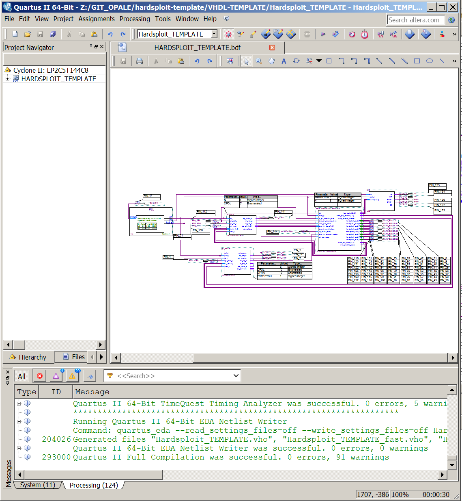
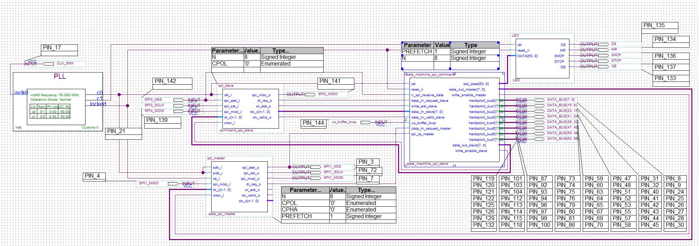
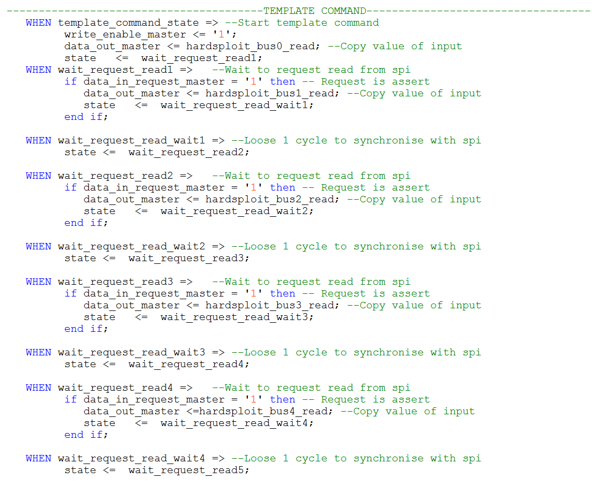
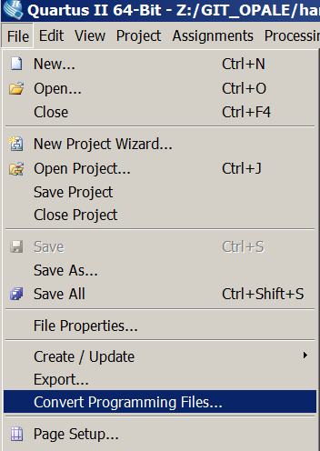
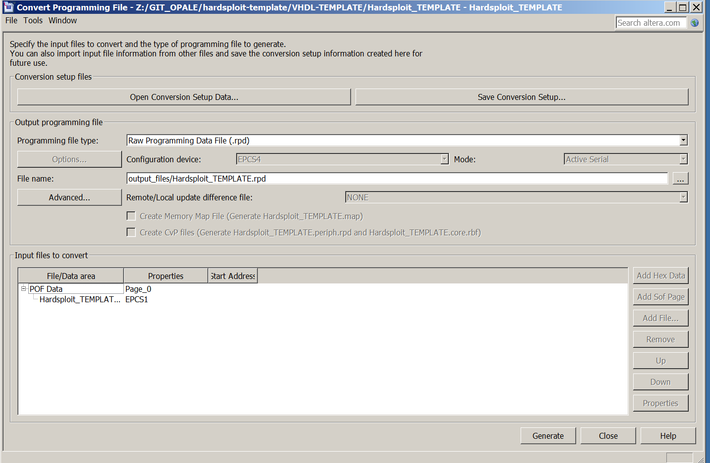

# CREATE YOUR OWN HARDSPLOIT MODULE

### Disclaimer:
Our purpose with this template is not to teach you how to code in VHDL. If you want to use it will need you previous knowledge in this domain

---


## 1. Clone the latest API & TEMPLATE repository from github
```bash
mkdir template-project
cd template-project
git clone https://github.com/OPALESECURITY/hardsploit-template
git clone https://github.com/OPALESECURITY/hardsploit-api
```
## 2. Download Quartus II V13.0sp1 Web edition

First thing You need to do is to download and install Altera Quartus II Web Edition (free).
Be careful, Cyclone II support was removed from the lastest version so it's better to not use this one.

For example, Quartus II V13.0sp1 Web edition works perfectly with CYCLONE II FPGA. You can find it here:

http://dl.altera.com/13.0sp1/?edition=web

In VHDL-TEMPLATE folder you have the Quartus project "Hardsploit_TEMPLATE.qpf"

## 3. Create you own custom FPA MODULE (in VHDL)



You can edit the VHDL code in this template which can be seen as a "hello-world".

You can see the led module (shift register) to drive the 64 leds.

You can modify the state machine to process the command from the Ruby API
You can create your own VHDL module based on this example.



After that, you need to synthesize your project.

## 4. Export to RPD (bitstream) file



## 5. Create your own custom API (ruby)

You need to create your own function in hardsploit API like the example to communicate with FPGA

```ruby
def templateModule
	packet = Array.new

	#Header
	packet.push 0  #low byte of lenght of trame refresh automaticly before send by usb
	packet.push 0  #high byte of lenght of trame refresh automaticly before send by usb
	packet.push HardsploitAPI.lowByte(HardsploitAPI::USB_COMMAND::FPGA_COMMAND)
	packet.push HardsploitAPI.highByte(HardsploitAPI::USB_COMMAND::FPGA_COMMAND)

	#Custom command is 0xFE and return 8Bytes (8*8=64 inputs, see VHDL state machine)
	packet.push 0xFE

	#Send and receive packet (timeout 2s)
	data = HardAPI.sendAndReceiveDATA(packet,2000)

	#Processing the result, in this case, removing header (4 bytes, 2 for size & 2 for the type of command)
	data = data.drop(4)

 	if (data.size == 8) then
	 	#return value of 64 inputs
	 	return  0 |  (data[0] << 0) |  (data[1] << 8) | (data[2] << 16)  |  (data[3] << 24) |  (data[4] << 32) |  (data[5] << 40)  |  (data[6] << 48)  | (data[7] << 56)
	 else
	 	raise "Issue !"
	 end
end
```

## 6. Upload firmware by the API

You will have to use the upload firmware function each time you modify it.

If you disconnect the board, the firmware will stay inside the fpga external memory.

You can upload your firmware one time but if you use the Hardsploit GUI you will need to reupload your module to be sure it is your own.


In API you can upload your custom firmware (RPD file) like that
```ruby
print "Upload template firmware & check is : #{HardAPI.uploadFirmware(File.expand_path(File.dirname(__FILE__)) +  "/VHDL-TEMPLATE/output_files/HARDSPLOIT_TEMPLATE.rpd",true)}\n"
```

## 7. Start your own custom module
In this example :

You can use led with hardsploitApi

```ruby
HardAPI.setWiringLeds(0xFF000000000000FF)
```

You can use your custom module (in this case you can read 64 IO of hardsploit)
```ruby
# (you can use a cable and put it on 0v or 3.3V(or not connected) to check if it is works)
# "0111111111111111111111111111111111111111111111111111111111111111"
# "1111111111111111111111111111111111111111111111111111101111111111"
# "1111111111111111111111111111110111111111111111111111111111111111"
# "1111111111111111111111111111111111111111111111111111011111111111"
# "1111111111111111111111111101111111111011111110111111111111111111" with 3 wires put on 0V
# "1111111111111111111111111111111111111111101111111111111111111111"
# "1111111111111111111111111111111111110111111111111111111111111111"
# "1111111111111111101111111111111111111111111111111111111111111111"
# "1111111111111111111111111111111111111111111111111110111111111111"
# "1111111111111111111111110110111111111111111111111111111111111111" with two wires put on 0v
# "1111111111111111111111111111111111111111111111111111111111111110"
# "1111111011111111111111111111111111111111111111111111111111111111"
p templateModule.to_s(2).rjust(64, '0')
```

To start your custom API

```bash
ruby HardsploitTemplate.rb
or
./HardsploitTemple.rb
```

For any question about this template please feel free to contact us here: http://hardsploit.io/forums/forum/hardsploit-support/technical-questions/
